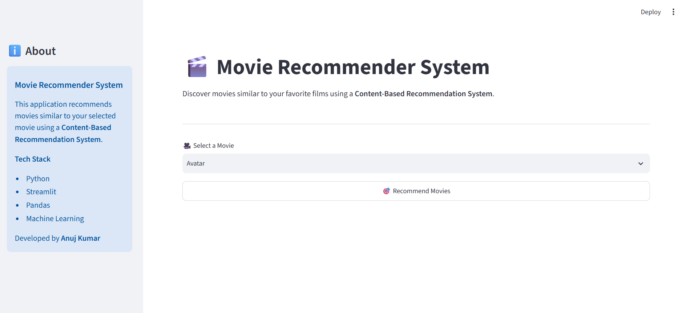
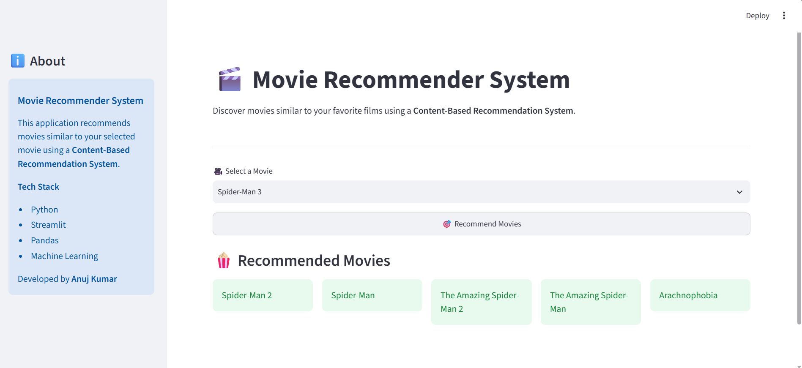

# 🎬 Movie Recommendation System


A **content-based Movie Recommendation System** built using **Python**, **Streamlit**, and **Machine Learning**. The application recommends movies similar to a user's selected movie by analyzing movie metadata such as genres, cast, crew, keywords, and overview.

---

# 📖 Project Overview

Finding the perfect movie among thousands of options can be challenging. This project simplifies that process by using a **content-based recommendation algorithm** to suggest similar movies based on their features.

Users simply choose a movie from the dropdown menu and receive personalized recommendations instantly through an interactive web interface.

---

# ✨ Features

- 🎥 Recommend similar movies instantly
- 🤖 Content-based recommendation algorithm
- ⚡ Fast recommendation generation
- 🎨 Interactive Streamlit user interface
- 📚 Preprocessed movie dataset
- 💻 Easy to run locally
- 📱 Simple and user-friendly design

---

# 🛠️ Tech Stack

| Technology | Purpose |
|------------|---------|
| Python | Programming Language |
| Streamlit | Web Application |
| Pandas | Data Processing |
| NumPy | Numerical Computing |
| Scikit-learn | Machine Learning |
| Pickle | Model Storage |

---

# 📂 Project Structure

```text
Movie-Recommended-System/
│── app.py
│── requirements.txt
│── movies.pkl
│── movies_dict.pkl
│── similarity.pkl (Not Included)
│── README.md
│── .gitignore
│── images/
│   ├── home.png
│   └── recommendation.png
```

> **Note:** `similarity.pkl` is not included because it exceeds GitHub's 100 MB file size limit. Generate it locally before running the application.

---

# 🚀 Live Demo

Coming Soon...

*(Update this section after deploying on Streamlit Community Cloud.)*

---

# ⚙️ Installation

### Clone the repository

```bash
git clone https://github.com/AnujKumar0109/Movie-Recommended-System.git
```

### Navigate to the project directory

```bash
cd Movie-Recommended-System
```

### Install dependencies

```bash
pip install -r requirements.txt
```

### Run the application

```bash
streamlit run app.py
```

The application will open automatically in your default browser.

---

# ▶️ Usage

1. Launch the application.
2. Select a movie from the dropdown list.
3. Click the **Recommend** button.
4. View the recommended movies.

---

# 📸 Screenshots

## Home Page



## Recommendation Results



---

# 📊 Dataset

This project uses a preprocessed movie dataset containing:

- Movie Titles
- Genres
- Keywords
- Cast
- Crew
- Overview

The recommendation engine computes similarity between movies using feature vectors generated from the dataset.

---

# 🚀 Future Improvements

- 🔍 Search bar with autocomplete
- ⭐ Movie ratings integration
- 🎭 Genre-based filtering
- ❤️ Favorite movies list
- 👤 User authentication
- 🌐 Deploy on Streamlit Community Cloud
- 🤝 Hybrid recommendation system

---

# 🤝 Contributing

Contributions are welcome!

1. Fork the repository.
2. Create a new branch.

```bash
git checkout -b feature-name
```

3. Commit your changes.

```bash
git commit -m "Add new feature"
```

4. Push the branch.

```bash
git push origin feature-name
```

5. Open a Pull Request.

---

# 👨‍💻 Author

**Anuj Kumar**

- GitHub: https://github.com/AnujKumar0109
- Email: choudharyneeju990@gmail.com

---

# ⭐ Support

If you found this project helpful, consider giving it a ⭐ on GitHub.

---

# 📜 License

This project is licensed under the MIT License.
